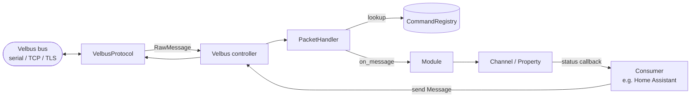

# velbus-aio developer documentation

This folder documents the internals of `velbus-aio`, the asyncio library that
talks to a Velbus home-automation bus.

| Document                                       | Topic                                                                                               |
| ---------------------------------------------- | --------------------------------------------------------------------------------------------------- |
| [message-receiving.md](./message-receiving.md) | How an incoming bus frame is received, parsed, dispatched and turned into channel/property updates. |
| [classes.md](./classes.md)                     | Description of the main classes and how they relate to each other.                                  |
| [module-scanning.md](./module-scanning.md)     | How modules are discovered and built during a bus scan.                                             |

## Big picture

The diagrams in this folder are written in [Mermaid](https://mermaid.js.org/) so
they render directly on GitHub and in most Markdown viewers.
