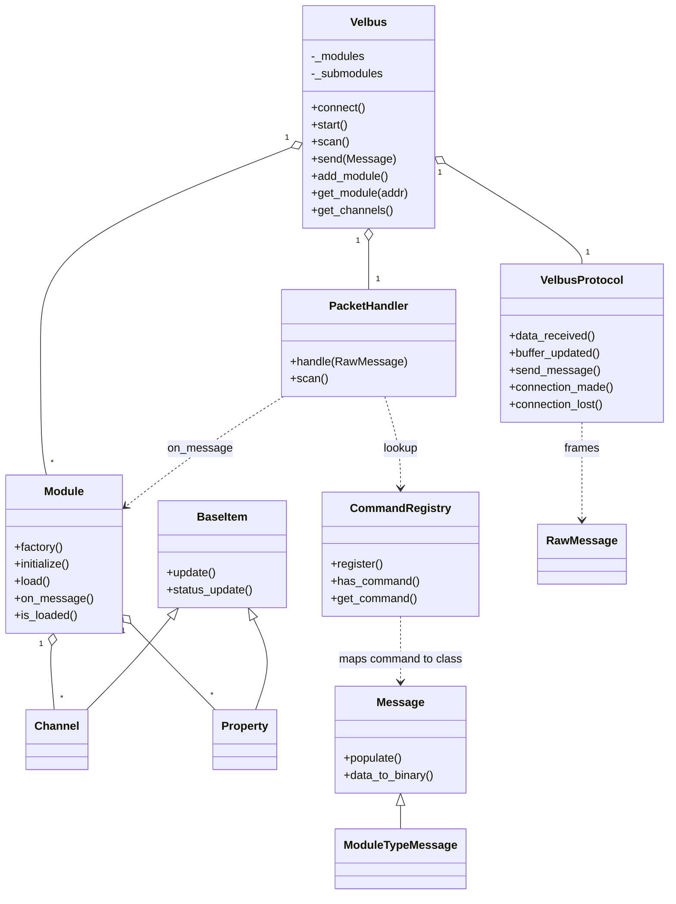

# Class descriptions

The main classes in `velbus-aio` and how they relate. Paths are relative to the
repository root.

## Relationship overview

## Controller layer

### `Velbus` — `velbusaio/controller.py`

The public entry point / controller. Owns the transport, the packet handler and
the module map, and is what consumers instantiate.

- **Owns:** a `VelbusProtocol`, a `PacketHandler`, `_modules` (address → `Module`)
  and `_submodules`.
- **Key methods:** `connect`, `start`, `scan`, `send`, `add_module`,
  `add_submodules`, `get_module`, `get_channels`, `sync_clock`, plus callback
  registration.
- **Connect:** opens a TCP/TLS connection with `asyncio.create_connection` or a
  serial connection with `serialx.create_serial_connection` (38400 baud).
  DSN forms include `tcp://host:port`, `tls://host:port`, bare `host:port`, and
  serial / `esphome://` URLs.

### `ScheduledTask` — `velbusaio/controller.py`

Small helper for interval callbacks, used by `add_scheduled_task`.

## Transport / framing layer

### `VelbusProtocol` — `velbusaio/protocol.py`

`asyncio.BufferedProtocol` implementing the Velbus wire format. Handles both
read paths (`get_buffer`/`buffer_updated` and `data_received`), frames bytes into
`RawMessage`, and runs a background writer task that paces outbound messages.
Also handles `connection_made` / `connection_lost`.

> Note: the class docstring mentions a wrapping `VelbusConnection`, but no such
> class exists — transport ownership and reconnect live on `Velbus` +
> `VelbusProtocol`.

### `VelbusDiscoveryProtocol` — `velbusaio/discovery.py`

UDP LAN discovery of Signum-style interfaces. Not on the main receive path.

## Packet handling / registry

### `PacketHandler` — `velbusaio/handler.py`

Orchestrates scanning and routes received packets. Holds a reference back to the
`Velbus` controller. `handle()` is the RX router; `scan()` drives module
discovery. Uses `_scanLock` / `_fullScanLock` to protect the module map during a
scan and tracks progress with `_scan_delay_msec` / `_scan_complete`.

### `CommandRegistry` — `velbusaio/command_registry.py`

Maps `(command_byte[, module_type]) → Message` class. Exposed as the singleton
`commandRegistry`. `MODULE_DIRECTORY` maps module type codes to names. The
`register` decorator registers `Message` subclasses at import time, which is what
makes `handle()`'s lookups succeed.

## Module layer

### `Module` — `velbusaio/module.py`

Represents one bus module (an address, its channels and its properties).

- **Construction:** `factory()` builds the right class (`Module` or a
  specialization) from the module type; `initialize()` loads JSON specs from
  `module_spec/{type:02X}.json` + `global.json` and builds `_message_handlers`.
- **Loading:** `load()` / `load_from_vlp()` populate channels, properties, name
  and channel names; `is_loaded()` reports completion.
- **Runtime:** `on_message()` dispatches an incoming message to the right handler
  and updates channels/properties.

### `VmbDali` — `velbusaio/module.py`

DALI specialization (types `0x45` / `0x5A`) with placeholder channels, a DALI
settings request, and a custom `on_message`.

## Channel / property layer

### `BaseItem` — `velbusaio/baseItem.py`

Shared base for channels and properties: name handling, optional writer,
`update` and status-callback plumbing.

### `Channel` — `velbusaio/channels.py`

Abstract channel with name parts and a `_is_loaded` flag. Subclasses include
`Blind`, `Button`, `ButtonCounter`, `Sensor`, `ThermostatChannel`, `Dimmer`,
`Temperature`, `SensorNumber`, `Relay`, `EdgeLit`.

### `Property` — `velbusaio/properties.py`

Module-level entities that are not channels: `PSUPower` / `Voltage` / `Current` /
`Load`, `MemoText`, `SelectedProgram`, `LightValue`, `BusErrorTx` / `BusErrorRx` /
`BusErrorOff`.

Relation: `Module._channels[num]` and `Module._properties[name]` are `BaseItem`
instances; when they have a `_writer` they can send via `Velbus.send`.

## Message layer

### `RawMessage` — `velbusaio/raw_message.py`

Wire-level framed packet (`priority`, `address`, `rtr`, `data`), with `to_bytes`
for transmit.

### `Message` — `velbusaio/message.py`

Abstract typed message: `populate` (bytes → fields), `data_to_binary`
(fields → bytes) and priority / RTR helpers.

### `DeclarativeMessage` — `velbusaio/message_fields.py`

Field-driven `Message` base that auto-generates `populate` / `data_to_binary` via
`__init_subclass__`.

### Concrete messages — `velbusaio/messages/*.py`

One class per command, usually decorated with `@register(cmd[, module_types])`.
Scan-relevant ones: `ModuleTypeRequestMessage` (RTR probe),
`ModuleTypeMessage` (`0xFF` reply), `ModuleSubTypeMessage`
(`0xB0` / `0xA7` / `0xA6` sub-addresses).

## Supporting

| Piece      | Path                      | Role                                                                  |
| ---------- | ------------------------- | --------------------------------------------------------------------- |
| `VlpFile`  | `velbusaio/vlp_reader.py` | Offline module config from a `.vlp` file (alternative to a bus scan). |
| Exceptions | `velbusaio/exceptions.py` | `VelbusConnectionFailed`, `VelbusConnectionTerminated`.               |
| Constants  | `velbusaio/const.py`      | Frame sizes, priorities, scan timeouts, `SLEEP_TIME`.                 |
