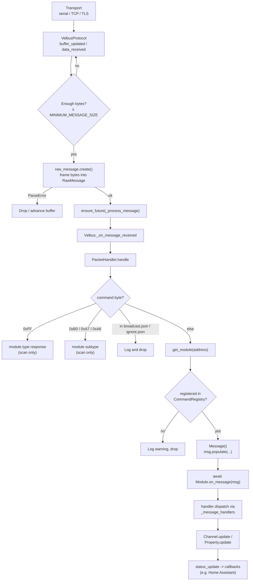
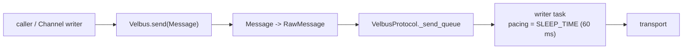

# Message receiving flow

This describes what happens from the moment bytes arrive on the transport until a
channel or property is updated and consumers are notified.

There is **no RX queue** between the transport and the handler: each framed
packet is scheduled as its own asyncio task, so receiving is fully
callback-driven.

## Pipeline overview



## Step-by-step

### A. Transport → framing

Incoming bytes reach `VelbusProtocol` (`velbusaio/protocol.py`), an
`asyncio.BufferedProtocol`. There are two asyncio entry points that converge on
the same framing logic:

- `get_buffer` / `buffer_updated` — the BufferedProtocol fast path used by TCP
  and `serialx`. `buffer_updated` copies the received bytes into `_serial_buf`
  and calls `data_received`.
- `data_received` — accumulates into `_serial_buf` and, while the buffer holds at
  least `MINIMUM_MESSAGE_SIZE` (6) bytes, takes up to `MAXIMUM_MESSAGE_SIZE`
  (14) bytes off the head and tries to frame them.

For every successfully framed packet it schedules an independent task:

```python
asyncio.ensure_future(self._process_message(msg))
```

`_process_message` simply awaits the callback wired up by the controller:

```python
await self._message_received_callback(msg)  # -> Velbus._on_message_received
```

### B. Byte parser (`RawMessage`)

`velbusaio/raw_message.py` turns raw bytes into a `RawMessage` NamedTuple
(`priority`, `address`, `rtr`, `data`).

- `create()` trims leading garbage and loops `_parse`, advancing on `ParseError`.
- `_parse()` validates the frame: STX `0x0F`, priority, length, ETX `0x04` and
  checksum, then returns `(RawMessage, remainder)`.

Frame layout (`velbusaio/const.py`):

```
[STX 0x0F][priority][address][RTR|len][data...][checksum][ETX 0x04]
```

Convenience properties: `RawMessage.command` is `data[0]`, `RawMessage.data_only`
is `data[1:]`.

### C. Controller hand-off

`Velbus._on_message_received` (`velbusaio/controller.py`) forwards every
`RawMessage` to `PacketHandler.handle`.

### D. Packet dispatch (`PacketHandler.handle`)

`velbusaio/handler.py`, `handle()`. Guards: `address` must be 1–254 and a
`command` byte must be present. Then it branches on the command value:

| Branch         | Condition                                             | Action                                                                                                                 |
| -------------- | ----------------------------------------------------- | ---------------------------------------------------------------------------------------------------------------------- |
| Module type    | `command == 0xFF`                                     | `__handle_module_type_response_async` — used during scanning.                                                          |
| Module subtype | `command in (0xB0, 0xA7, 0xA6)` and scan not complete | Build `ModuleSubTypeMessage`, set sub-address offset (0 / 4 / 8), `_handle_module_subtype`.                            |
| Broadcast      | hex command in `broadcast.json`                       | Log and drop.                                                                                                          |
| Ignore         | hex command in `ignore.json`                          | Log and drop.                                                                                                          |
| Module traffic | else                                                  | Look up the module, look up the `Message` class in `commandRegistry`, populate it, and `await module.on_message(msg)`. |

For normal module traffic the lookup is
`commandRegistry.get_command(command_value, module_type)`. This only works
because concrete `Message` subclasses register themselves at import time via the
`@register` decorator (`velbusaio/command_registry.py`).

Certain info commands (`0xF0`, `0xF1`, `0xF2`, `0xFB`, `0xFE`, `0xCC` — names and
memory data) additionally bump `_scan_delay_msec` so the scanner waits for
in-flight load traffic.

### E. Module → channel/property updates

`velbusaio/module.py`, `Module.on_message`:

1. Compute the sub-address channel offset for the message.
2. Look up `type(message)` in `_message_handlers` (built by
   `_build_message_handlers`).
3. Call the matched `_handle_*` / `_process_*` handler, then set the
   `_got_status` event.

Handlers call `_update_channel` or `_update_property`, which delegate to
`Channel.update` / `Property.update` (`velbusaio/channels.py`,
`velbusaio/properties.py`). `update` only writes attributes that actually
changed and then calls `status_update`, invoking every registered callback (for
example, the Home Assistant integration).

## Outbound (for contrast)

Sending is the mirror image and is serialized through a background writer task:



## Key references

| Topic               | Location                                                                                  |
| ------------------- | ----------------------------------------------------------------------------------------- |
| Framing             | `velbusaio/protocol.py` — `buffer_updated`, `data_received`, `_process_message`           |
| Parse               | `velbusaio/raw_message.py` — `create`, `_parse`                                           |
| Controller hand-off | `velbusaio/controller.py` — `_on_message_received`                                        |
| Dispatch            | `velbusaio/handler.py` — `handle`                                                         |
| Module update       | `velbusaio/module.py` — `on_message`, `_build_message_handlers`                           |
| Channel update      | `velbusaio/channels.py` — `Channel.update`; `velbusaio/properties.py` — `Property.update` |
| Registry            | `velbusaio/command_registry.py` — `CommandRegistry`, `commandRegistry`, `register`        |
