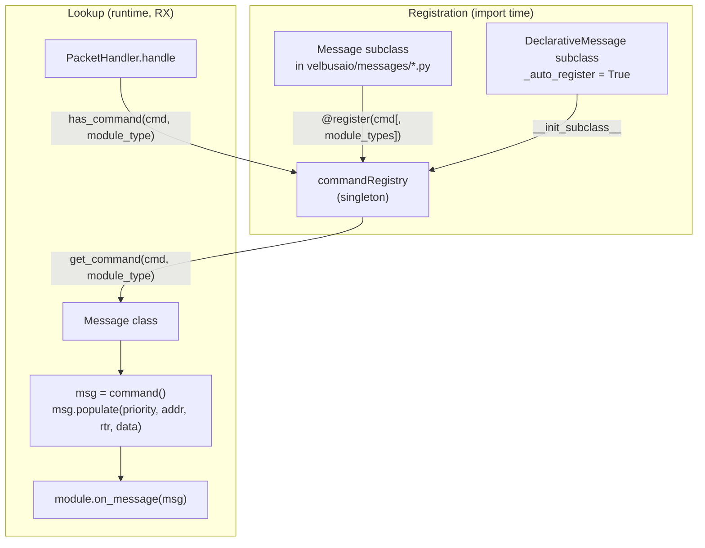
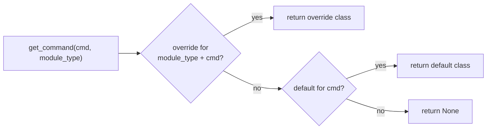
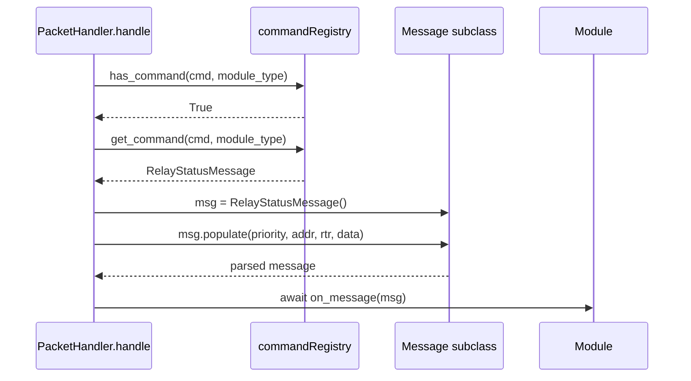

# Message & registry system

Velbus commands are identified by a single command byte, but the same byte can
mean different things on different module types. The **command registry** maps an
incoming `(command_byte[, module_type])` to the right `Message` subclass, and the
**message classes** know how to parse bytes into fields (`populate`) and fields
back into bytes (`data_to_binary`).

## Overview



Everything hinges on two things happening before the handler runs:

1. every concrete `Message` module is imported (side-effect: it registers), and
2. `commandRegistry` is a single shared instance.

## The registry

File: `velbusaio/command_registry.py`.

### `MODULE_DIRECTORY`

A `dict[int, str]` mapping module type codes to model names, e.g.
`0x02 → "VMB1RY"`, `0x45 → "VMBDALI"`. It is the source of truth used to validate
module names during registration and to resolve a module type from a name.

### `CommandRegistry`

Holds two tables:

- `_default_commands: {command_value -> class}` — commands that mean the same
  thing on every module.
- `_overrides: {module_type -> {command_value -> class}}` — per-module-type
  specializations for a command byte.

| Method                                                             | Purpose                                                                                                                                                                                                                                                                    |
| ------------------------------------------------------------------ | -------------------------------------------------------------------------------------------------------------------------------------------------------------------------------------------------------------------------------------------------------------------------- |
| `register_command(command_value, command_class, module_name=None)` | Public registration. Validates `0 <= command_value <= 255`; if `module_name` is given it must exist in `MODULE_DIRECTORY`, and the class is stored as an override for that module type; otherwise it becomes a default. Double registration raises `CommandRegistryError`. |
| `has_command(command_value, module_type=0)`                        | True if an override for that module type or a default exists.                                                                                                                                                                                                              |
| `get_command(command_value, module_type=0)`                        | Returns the class — **override first, default second**, else `None`.                                                                                                                                                                                                       |

Lookup precedence at runtime:



This is exactly what `PacketHandler.handle` uses: it fetches the module, gets its
type, then `commandRegistry.get_command(command_value, module_type)`. A `None`
result is logged as `NOT FOUND IN command_registry`.

### The singleton

```python
commandRegistry = CommandRegistry(MODULE_DIRECTORY)
```

There is exactly one instance, imported everywhere. Registrations from all
message modules accumulate into it.

## Registering a message

There are two registration mechanisms; both target the same `commandRegistry`.

### 1. The `@register` decorator (most common)

```python
def register(command_value: int, module_types: list[str] | None = None):
    ...
```

- `@register(0xFB)` → registers as a **default** command.
- `@register(0xFF, ["VMB1BL", "VMB6IN", ...])` → registers as an **override** for
  each listed module type.

Example (`velbusaio/messages/relay_status.py`):

```python
@register(COMMAND_CODE)  # 0xFB, default
class RelayStatusMessage(DeclarativeMessage):
    _command_code = COMMAND_CODE
    _data_length = 7
    channel = ChannelField(0)
    ...
```

Example of overrides — `ModuleTypeMessage` vs `ModuleType2Message` both use
command `0xFF` but are registered for different module-type lists
(`velbusaio/messages/module_type.py`), so a `0xFF` reply is parsed by the class
matching the responding module's type.

### 2. `_auto_register` on a `DeclarativeMessage`

A `DeclarativeMessage` subclass can set `_auto_register = True` (plus
`_command_code` and optional `_module_types`); its `__init_subclass__` then calls
`commandRegistry.register_command(...)` automatically. In this codebase the
explicit `@register` decorator is the dominant style.

### Import-time side effects

Registration only happens when a message module is imported. That is why
`velbusaio/messages/__init__.py` imports every concrete message class, and why
`module.py` / the messages package are pulled in early. If a class is never
imported, `get_command` returns `None` for its command byte.

## The message classes

### `Message` — `velbusaio/message.py`

Abstract base for typed messages. Attributes: `priority`, `address`, `rtr`,
`data`. Contract:

- `populate(priority, address, rtr, data)` — parse a `RawMessage`'s fields into
  attributes (raises `NotImplementedError` if not overridden).
- `data_to_binary()` — serialize attributes back to the wire payload.
- Priority / RTR helpers: `set_low_priority` / `set_high_priority` /
  `set_firmware_priority`, `set_rtr` / `set_no_rtr`, and matching `needs_*`
  validators used inside `populate` (e.g. `needs_low_priority`, `needs_no_rtr`,
  `needs_data`).
- Channel-bit helpers: `byte_to_channels`, `channels_to_byte`, `byte_to_channel`.
- `to_json` / `to_json_basic` / `__str__` for debugging.

`ParserError` is raised by `parser_error` when a frame doesn't match
expectations.

### `DeclarativeMessage` — `velbusaio/message_fields.py`

A `Message` subclass that generates the boilerplate from declared fields. Class
vars configure behavior:

| Class var                                          | Meaning                                                         |
| -------------------------------------------------- | --------------------------------------------------------------- |
| `_command_code`                                    | Command byte for this message.                                  |
| `_module_types`                                    | Module types for auto-registration (with `_auto_register`).     |
| `_priority` / `_rtr` / `_data_length`              | Defaults / validation for the frame.                            |
| `_auto_register`                                   | If True, register in `commandRegistry` via `__init_subclass__`. |
| `_generates_data_to_binary` / `_generates_to_json` | Toggle generated serializers.                                   |

`__init_subclass__` collects the declared `Field` descriptors and auto-generates
`__init__`, `set_defaults`, `populate`, and (optionally) `data_to_binary` /
`to_json`, unless the subclass defines them explicitly.

### Fields — `velbusaio/message_fields.py`

Field descriptors declare how a byte offset maps to a Python attribute, so
subclasses read like a spec. Available field types include: `ByteField`,
`BitField`, `MappedField`, `ComputedField`, `RawTailField`, `ChannelsField`,
`ChannelField`, `ChannelIndexField`, `Int16Field`, `Int24Field`,
`BlindChannelField`, `BlindStatusField`, `TemperatureField`, `StringField`.

Example — a relay status frame declared purely as fields:

```python
class RelayStatusMessage(DeclarativeMessage):
    _command_code = 0xFB
    _data_length = 7
    channel = ChannelField(0)
    disable_inhibit_forced = ByteField(1)
    status = ByteField(2)
    led_status = ByteField(3)
    delay_time = Int24Field(4)
```

Here the generated `populate` reads byte 0 as a channel, bytes 1–3 as single
bytes, and bytes 4–6 as a 24-bit integer.

### Concrete messages — `velbusaio/messages/*.py`

One class per command (sometimes several variants such as `...Message2` /
`...Message20` for newer module generations). Older classes subclass `Message`
directly and implement `populate` / `data_to_binary` by hand; newer ones subclass
`DeclarativeMessage` and declare fields. Both styles register through
`@register` (or `_auto_register`).

## How it all fits at runtime



## Key references

| Topic                     | Location                                                                                               |
| ------------------------- | ------------------------------------------------------------------------------------------------------ |
| Registry                  | `velbusaio/command_registry.py` — `CommandRegistry`, `commandRegistry`, `register`, `MODULE_DIRECTORY` |
| Runtime lookup            | `velbusaio/handler.py` — `handle` (`has_command` / `get_command`)                                      |
| Message base              | `velbusaio/message.py` — `Message`, `ParserError`                                                      |
| Declarative base + fields | `velbusaio/message_fields.py` — `DeclarativeMessage`, `Field` subclasses                               |
| Import side effects       | `velbusaio/messages/__init__.py`                                                                       |
| Override example          | `velbusaio/messages/module_type.py` — `ModuleTypeMessage` / `ModuleType2Message` on `0xFF`             |
| Default example           | `velbusaio/messages/relay_status.py` — `RelayStatusMessage` on `0xFB`                                  |
