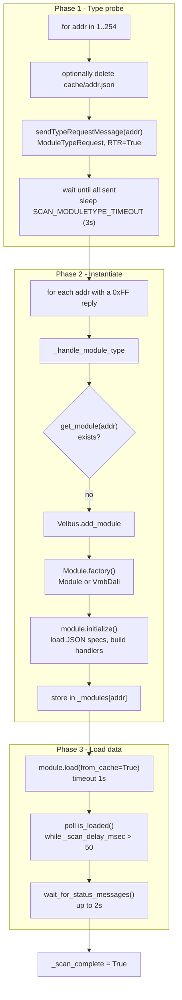
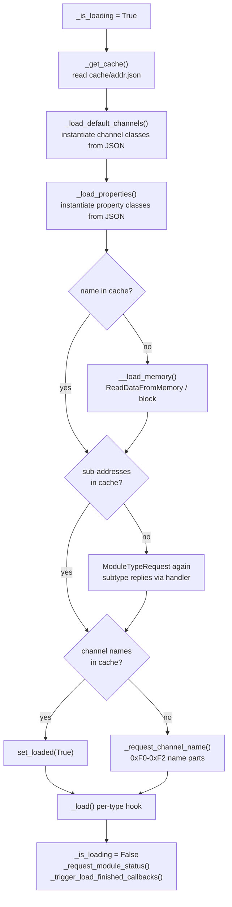

# Module build / scanning flow

How modules are discovered on the bus and turned into fully loaded `Module`
objects with channels, properties and names.

## Entry points

| Call                 | Location                  | Behavior                                                                                                                                |
| -------------------- | ------------------------- | --------------------------------------------------------------------------------------------------------------------------------------- |
| `Velbus.start()`     | `velbusaio/controller.py` | Authenticate if needed; if a VLP file was supplied use the offline path, otherwise create the cache dir and run `PacketHandler.scan()`. |
| `Velbus.scan()`      | `velbusaio/controller.py` | `PacketHandler.scan(reload_cache=True)` — forces per-address cache deletion.                                                            |
| `PacketHandler.scan` | `velbusaio/handler.py`    | The full bus discovery routine.                                                                                                         |

## The three phases



### Phase 1 — Type probe (addresses 1–254)

`PacketHandler.scan`:

1. Optional single-address mode (`one_address`).
2. Wait until the TX queue is empty (`wait_on_all_messages_sent_async`).
3. For each address 1–254:
   - if `reload_cache`, delete `{cache_dir}/{address}.json`;
   - mark `__scan_found_addresses[address] = None`;
   - `await self._velbus.sendTypeRequestMessage(address)` under `_scanLock`.
4. Wait for all probes to be sent, then sleep `SCAN_MODULETYPE_TIMEOUT` (3000 ms).

The probe is a `ModuleTypeRequestMessage` (`velbusaio/messages/module_type_request.py`):
low priority, **RTR=True**, empty data.

Responses arrive asynchronously and interleaved. In `PacketHandler.handle`,
`command == 0xFF` routes to `__handle_module_type_response_async`, which builds
and populates a `ModuleTypeMessage` and stores it in
`__scan_found_addresses[address]`. `ModuleTypeMessage.populate`
(`velbusaio/messages/module_type.py`) extracts the type, serial, memory map and
build year/week.

### Phase 2 — Instantiate modules

For each address that produced a type message:

1. `await self._handle_module_type(module_type_message)`.
2. If `get_module(addr)` is `None`, call `Velbus.add_module(...)`, which:
   - runs `Module.factory(...)` → a `Module` (or `VmbDali` for types
     `0x45` / `0x5A`);
   - calls `await module.initialize(self.send, self)` — loads JSON specs, builds
     `_message_handlers`, and sets the writer;
   - stores the module in `_modules[addr]`.

### Phase 3 — Load module data

Still inside the scan loop:

```python
await asyncio.wait_for(
    module.load(from_cache=True),
    SCAN_MODULEINFO_TIMEOUT_INITIAL / 1000.0,  # 1.0 s
)
while self._scan_delay_msec > 50 and not await module.is_loaded():
    self._scan_delay_msec -= 50
    await asyncio.sleep(0.05)
await module.wait_for_status_messages()  # up to 2s for _got_status
```

`Module.load` (`velbusaio/module.py`):



- **Channels** — `_load_default_channels` reads the JSON `Channels` and does
  `getattr(channels_module, Type)` to instantiate e.g. `Relay`, `Button`.
  Non-editable channels start with `_is_loaded = True`.
- **Properties** — `_load_properties` does the same for JSON `Properties`.
- **Name / memory** — `__load_memory` uses `ReadDataFromMemoryMessage` /
  `ReadDataBlockFromMemoryMessage`; replies feed `_process_memory_*` which fill
  the name buffer and channel match data.
- **Channel names** — `_request_channel_name` sends `ChannelNameRequestMessage`;
  replies (`0xF0`–`0xF2`) go to `_process_channel_name_message` →
  `Channel.set_name_part`. A channel needs parts 1+2+3 before `_is_loaded` flips.
- **Sub-addresses** — subtype commands `0xB0` / `0xA7` / `0xA6` reach
  `_handle_module_subtype` → `Velbus.add_submodules` → `module.add_subaddress`
  and `cleanupSubChannels`.

Scan progress is kept alive by delayed info traffic: whenever a name/memory
message arrives during the scan, `_scan_delay_msec` is bumped
(`SCAN_MODULEINFO_TIMEOUT_INTERVAL`), extending the polling window.

## When is a module "loaded"?

`Module.is_loaded` (`velbusaio/module.py`):

1. if `self.loaded` is already set → `True`;
2. if `_is_loading` → `False`;
3. if `_name_buffer` is non-empty (name assembly incomplete) → `False`;
4. if any channel is `not chan.is_loaded()` → `False`;
5. otherwise set `self.loaded = True`, write the cache, return `True`.

So "loaded" means: `load()` finished its work, the module name buffer is empty,
and every editable channel has a complete name (or was non-editable / restored
from cache). Status values can still arrive afterwards via the `_got_status`
event and `wait_for_status_messages`.

## Alternate path: VLP (no bus scan)

`Velbus.start` with a `vlp_file` (`velbusaio/controller.py`):

1. `VlpFile.read()` / `get()` parses the offline config.
2. `add_module` (+ optional `add_submodules`).
3. DALI modules (`0x45` / `0x5A`) run `module.load()`; other modules run
   `load_from_vlp`, which marks all channels loaded and then requests status.

## Key references

| Topic           | Location                                                                                                                            |
| --------------- | ----------------------------------------------------------------------------------------------------------------------------------- |
| Scan            | `velbusaio/handler.py` — `scan`, `__handle_module_type_response_async`, `_handle_module_type`, `_handle_module_subtype`             |
| Instantiate     | `velbusaio/controller.py` — `add_module`, `add_submodules`; `velbusaio/module.py` — `factory`, `initialize`                         |
| Load            | `velbusaio/module.py` — `load`, `_load_default_channels`, `_load_properties`, `__load_memory`, `_request_channel_name`, `is_loaded` |
| Probe / replies | `velbusaio/messages/module_type_request.py`, `module_type.py`, `module_subtype.py`                                                  |
| Timeouts        | `velbusaio/const.py` — `SCAN_MODULETYPE_TIMEOUT`, `SCAN_MODULEINFO_TIMEOUT_INITIAL`, `SCAN_MODULEINFO_TIMEOUT_INTERVAL`             |
